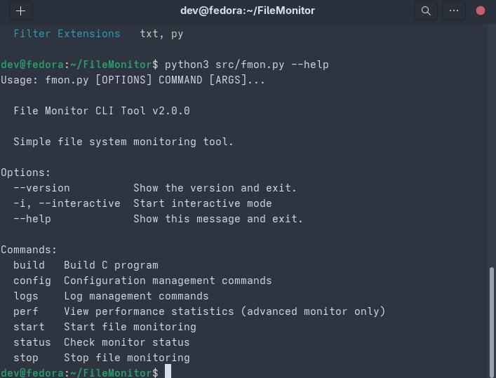

# File Monitor

A real-time file system monitoring tool.



## Quick Start

You can install and run the tool at once by cloning the repository and running the script below.

```bash
git clone https://github.com/zeetee1235/FileMonitor.git
cd FileMonitor
chmod +x scripts/setup.sh
./scripts/setup.sh
```

This script automatically handles everything from installing dependencies and building the program to launching the interactive menu.

## Usage

### Interactive Menu (Recommended)

The easiest way to use the tool is through the interactive menu.

```bash
./scripts/run_interactive.sh
```

From the menu, you can start/stop monitoring, view logs, change settings, and more.

### Command Line (CLI)

You can also control monitoring directly using the CLI.

```bash
# Start monitoring the current directory in basic mode
python3 src/fmon.py start . --mode=basic

# Start in advanced mode
python3 src/fmon.py start . --mode=advanced

# Check status
python3 src/fmon.py status

# View logs
python3 src/fmon.py logs show

# Stop monitoring
python3 src/fmon.py stop
```

## Monitoring Modes

A single program supports three modes.

- **Basic**: Tracks basic events like file creation, modification, and deletion.
- **Advanced**: In addition to Basic features, it provides **SHA256 checksums** for file integrity verification and **log rotation**.
- **Enhanced**: In addition to Basic features, it offers **dynamic watch management**, removing the limit on the number of files that can be watched and using resources efficiently.

## Configuration

You can change the settings by copying the `config/monitor.conf.example` file to `config/monitor.conf`.

```bash
cp config/monitor.conf.example config/monitor.conf
```

For example, you can set the monitor to only track specific file extensions in the `monitor.conf` file.

```ini
# Monitor only files with .py and .js extensions
extension=py
extension=js
```

## Development

Use `make` to build the source code yourself.

```bash
# Install dependencies (for Ubuntu/Debian)
sudo apt update && sudo apt install -y gcc libjson-c-dev libssl-dev zlib1g-dev python3-pip
pip3 install --user -r requirements.txt

# Build
make all

# Test
make test
```

## License

This project is licensed under the MIT License. See the [LICENSE](LICENSE) file for details.

