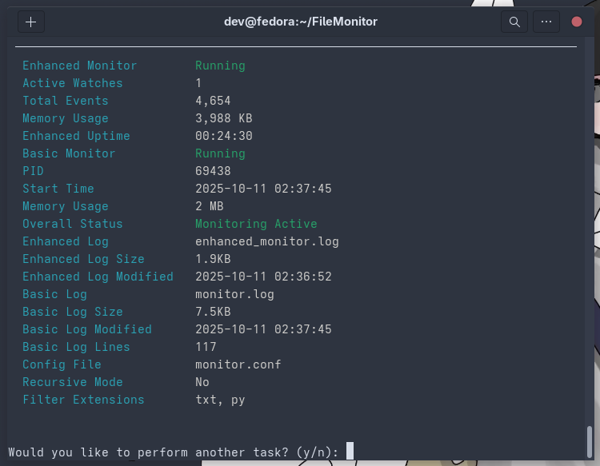

# File Monitor

Real-time file system monitoring tool with simple terminal interface and comprehensive logging capabilities.



#
## Quick Start

### One-Command Setup & Run

```bash
git clone https://github.com/your-username/FileMonitor.git
cd FileMonitor
chmod +x setup_and_run.sh
./setup_and_run.sh
```

This script will:
- Install all dependencies (GCC, Python packages)
- Build the C monitoring program
- Create configuration files
- Set up test environment
- Launch interactive menu

### Manual Installation

1. **Install dependencies:**
   ```bash
   # Ubuntu/Debian
   sudo apt update && sudo apt install gcc libjson-c-dev python3-pip
   
   # Fedora/RHEL
   sudo dnf install gcc json-c-devel python3-pip
   
   # Arch Linux
   sudo pacman -S gcc json-c python-pip
   ```

2. **Install Python packages:**
   ```bash
   pip3 install --user -r requirements.txt
   ```

3. **Build the monitor:**
   ```bash
   python3 src/fmon.py build -t all
   ```

## Usage

### Interactive Mode (Recommended)
```bash
python3 src/interactive_menu.py
# or
python3 src/fmon.py --interactive
```

Use arrow keys to navigate through options:
- Start/stop monitoring
- View logs and status
- Configure settings
- Test monitoring

### Command Line Interface

**Start monitoring current directory:**
```bash
python3 src/fmon.py start . --background
```

**Monitor parent directory (project root):**
```bash
python3 src/fmon.py start . --parent --background
```

**Monitor project root automatically:**
```bash
python3 src/fmon.py start . --project-root --background
```

**Enhanced monitoring with unlimited capacity:**
```bash
python3 src/fmon.py start /large/directory --enhanced --background
```

**Monitor parent directory with specific levels:**
```bash
python3 src/fmon.py start /path/to/dir --parent --levels 3 --background
```

**Check status (supports all monitor types):**
```bash
python3 src/fmon.py status
```

**View performance statistics:**
```bash
python3 src/fmon.py perf
```

**View recent logs:**
```bash
python3 src/fmon.py logs show
python3 src/fmon.py logs show --enhanced  # Enhanced monitor logs
```

**Real-time log monitoring:**
```bash
python3 src/fmon.py logs tail
python3 src/fmon.py logs tail --enhanced  # Enhanced monitor logs
```

**Stop monitoring:**
```bash
python3 src/fmon.py stop
```

### Configuration

Edit `monitor.conf` to customize monitoring:

```ini
# Enable recursive directory monitoring
recursive=true

# Monitor specific file extensions
extension=js
extension=html
extension=css
extension=py
extension=json
```

**Configuration commands:**
```bash
# Set extensions
python3 src/fmon.py config set extensions txt,py,js

# Set recursive mode
python3 src/fmon.py config set recursive true

# Show current config
python3 src/fmon.py config show
```

## Features in Detail

### Enhanced Monitoring System
- **Three monitor types**: Basic, Advanced (with checksums), Enhanced (dynamic scaling)
- **Dynamic watch management**: No hard limits on watched directories
- **Real-time statistics**: Memory usage, event counts, watch statistics
- **Automatic scaling**: Watch capacity expands based on needs
- **Performance metrics**: JSON-based statistics with detailed monitoring info

### Parent Directory & Project Monitoring
- **Parent directory monitoring**: Monitor 1-5 levels up from current directory
- **Project root detection**: Automatically detect `.git`, `package.json`, `requirements.txt`, etc.
- **Smart targeting**: Monitor entire project from any subdirectory
- **Flexible levels**: Choose how many parent levels to monitor

### Real-time Monitoring
- **File events**: Create, modify, delete, move, attribute changes
- **Directory monitoring**: Recursive or single-level
- **Performance**: Low CPU usage with inotify
- **Filtering**: Extension-based filtering for focused monitoring
- **Unlimited capacity**: Enhanced monitor handles large directory trees

### Logging & Analysis
- **Comprehensive logs**: All events with timestamps
- **Enhanced statistics**: Real-time metrics in JSON format
- **Log viewing**: Show recent entries or real-time monitoring
- **Log rotation**: Automatic log management for enhanced monitor
- **Color-coded logs**: Error, info, and debug level highlighting


## Advanced Usage

### Enhanced Monitoring
```bash
# Start enhanced monitoring with unlimited capacity
python3 src/fmon.py start /large/project --enhanced --background

# Monitor with project root detection
python3 src/fmon.py start . --project-root --enhanced --background

# View enhanced statistics
python3 src/fmon.py perf  # Shows both basic and enhanced stats

# View enhanced logs with color coding
python3 src/fmon.py logs show --enhanced
python3 src/fmon.py logs tail --enhanced
```

### Parent Directory Monitoring
```bash
# Monitor parent directory (1 level up)
python3 src/fmon.py start . --parent --background

# Monitor specific levels up
python3 src/fmon.py start /project/src --parent --levels 2 --background

# Auto-detect and monitor project root
python3 src/fmon.py start . --project-root --background
```

### Background Monitoring
```bash
# Start background monitoring
python3 src/fmon.py start /home/user/projects --background

# Enhanced background monitoring
python3 src/fmon.py start . --enhanced --project-root --background

# Check if running (shows all monitor types)
python3 src/fmon.py status

# View logs while running
python3 src/fmon.py logs tail
```

### Performance Monitoring
```bash
# View real-time performance statistics
python3 src/fmon.py perf

# Monitor performance in real-time
watch -n 2 'python3 src/fmon.py perf'
```

### Log Viewing
```bash
# Show recent logs
python3 src/fmon.py logs show

# Real-time log monitoring
python3 src/fmon.py logs tail
```

### Custom Configuration
```bash
# Set custom extensions
python3 src/fmon.py config set extensions js,ts,jsx,tsx
python3 src/fmon.py config set recursive true

# View current config
python3 src/fmon.py config show
```

## Project Structure

```
FileMonitor/
├── src/                    # Source code
│   ├── main.c             # C monitoring program (basic)
│   ├── advanced_monitor.c # C monitoring program (advanced with checksums)
│   ├── enhanced_monitor.c # C monitoring program (enhanced with dynamic scaling)
│   ├── fmon.py            # Python CLI interface
│   └── interactive_menu.py # Interactive menu system
├── docs/                   # Documentation
│   ├── QUICK_START.md     # Quick start guide
│   └── ENHANCED_FEATURES.md # Enhanced features guide
├── build/                 # Built executables
├── enhanced_stats.json   # Enhanced monitor statistics
├── enhanced_monitor.log  # Enhanced monitor logs
├── setup_and_run.sh      # Setup script
├── requirements.txt      # Python dependencies
└── README.md             # This file
```

## Development

### Building from Source
```bash
# Clone repository
git clone https://github.com/your-username/FileMonitor.git
cd FileMonitor

# Build C programs
python3 src/fmon.py build -t all

# Install Python dependencies
pip3 install --user -r requirements.txt
```

### Testing
```bash
# Test basic monitoring
python3 src/fmon.py start test_monitoring --background
echo "test content" > test_monitoring/test.txt
python3 src/fmon.py logs show
python3 src/fmon.py stop

# Test enhanced monitoring
python3 src/fmon.py start . --enhanced --background
touch test_file.txt
python3 src/fmon.py perf  # View enhanced statistics
python3 src/fmon.py logs show --enhanced
python3 src/fmon.py stop

# Test parent directory monitoring
mkdir -p project/src
cd project/src
python3 ../../src/fmon.py start . --parent --background
echo "test" > ../test.txt  # Create file in parent
python3 ../../src/fmon.py logs show
python3 ../../src/fmon.py stop
```

## Requirements

- **OS**: Linux (uses inotify)
- **Compiler**: GCC
- **Libraries**: json-c, pthread, openssl, zlib, pcre
- **Python**: 3.6+
- **Python packages**: rich, click, inquirer, psutil

## License

This project is licensed under the MIT License - see the [LICENSE](LICENSE) file for details.

## Acknowledgments

- Built with [Rich](https://github.com/Textualize/rich) for terminal output
- Uses [Click](https://github.com/pallets/click) for CLI framework
- Interactive menus powered by [Inquirer](https://github.com/magmax/python-inquirer)

## Documentation

- [Quick Start Guide](docs/QUICK_START.md) - Get started quickly
- [Enhanced Features Guide](docs/ENHANCED_FEATURES.md) - Detailed guide for new capabilities

---

<details>
<summary>Monitoring</summary>
<br>
<p align="center">
  
  <br>
  <em>mwah!</em>
  <br>
</p>
</details>

